<div align="center">
  <h1>
    <br/>
    Elderly Exercise App with SQLite Database
  </h1>
  <h3>A Comprehensive Solution for Elderly Fitness Management</h3>
</div>

<p align="center">
    <a href="https://github.com/jamalihassan0307/" target="_blank">
        
    </a>
    <a href="https://www.linkedin.com/in/jamalihassan0307/" target="_blank">
        
    </a>
</p>

## 📌 Overview

The Elderly Exercise App is a Flutter application designed to help elderly users maintain their fitness through guided exercises. The app features personalized workouts, progress tracking, and reminders to help users stay active and healthy.

## 🚀 Tech Stack

- **Flutter**
- **SQLite** (for local data storage)
- **Provider** (for state management)

## 🔑 Key Features

- ✅ **User Profile Management**: Personalized profiles with age, gender, height, and weight
- ✅ **Exercise Programs**: Customized workout routines for elderly users
- ✅ **Progress Tracking**: Monitor workout history and achievements
- ✅ **Exercise Timer**: Built-in timer for guided workout sessions
- ✅ **Reminders**: Customizable workout reminders
- ✅ **Offline Support**: Local data storage using SQLite

## 📸 Screenshots

### Banner


<table border="1">
  <tr>
    <td align="center">
      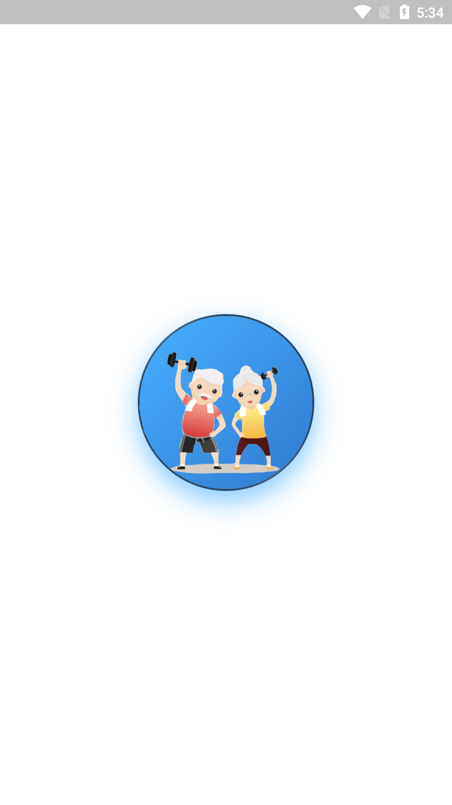
      <p><b>Splash Screen</b></p>
    </td>
    <td align="center">
      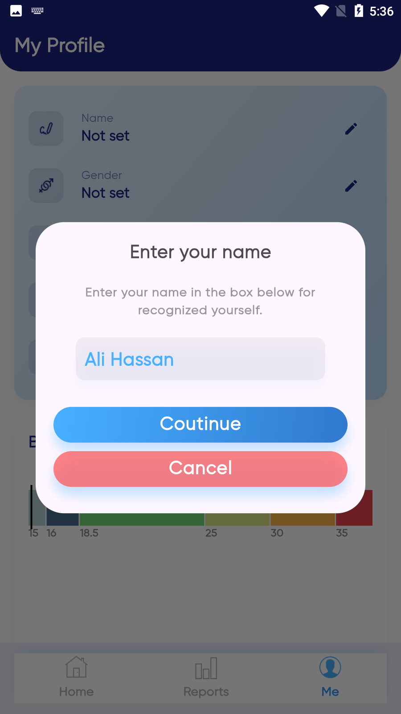
      <p><b>Name Selection</b></p>
    </td>
    <td align="center">
      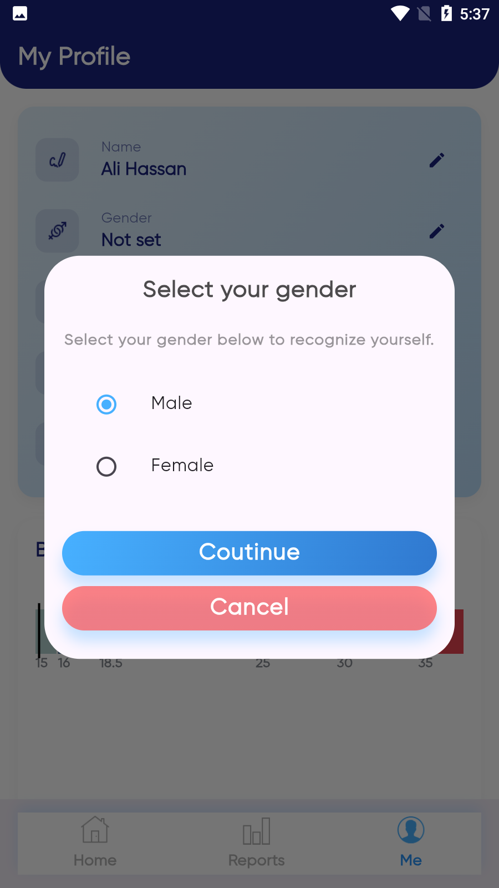
      <p><b>Gender Selection</b></p>
    </td>
  </tr>
  <tr>
    <td align="center">
      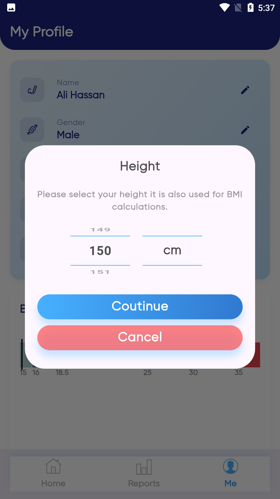
      <p><b>Height Selection</b></p>
    </td>
    <td align="center">
      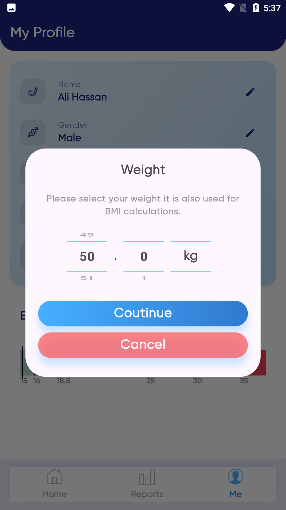
      <p><b>Weight Selection</b></p>
    </td>
    <td align="center">
      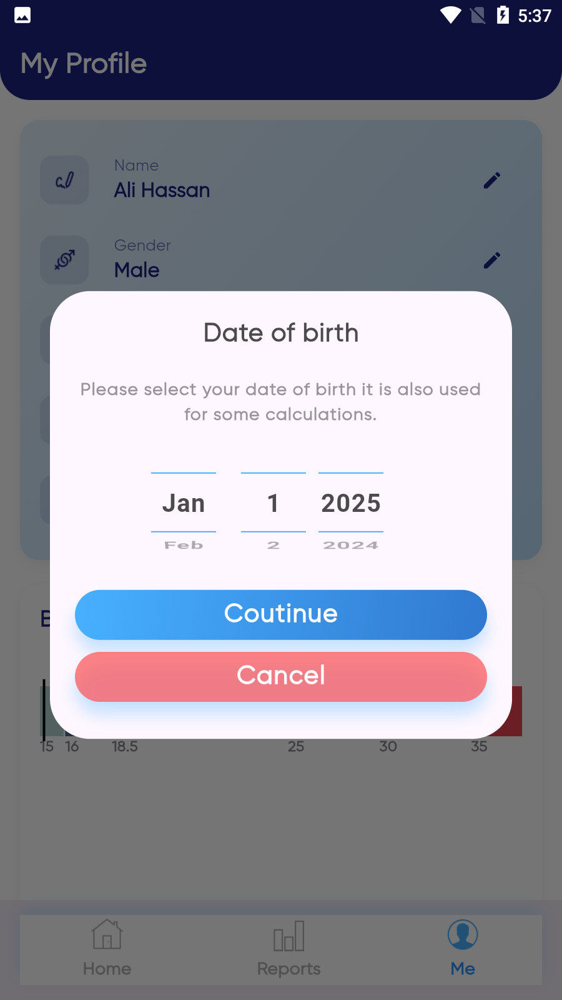
      <p><b>Date of Birth Selection</b></p>
    </td>
  </tr>
  <tr>
    <td align="center">
      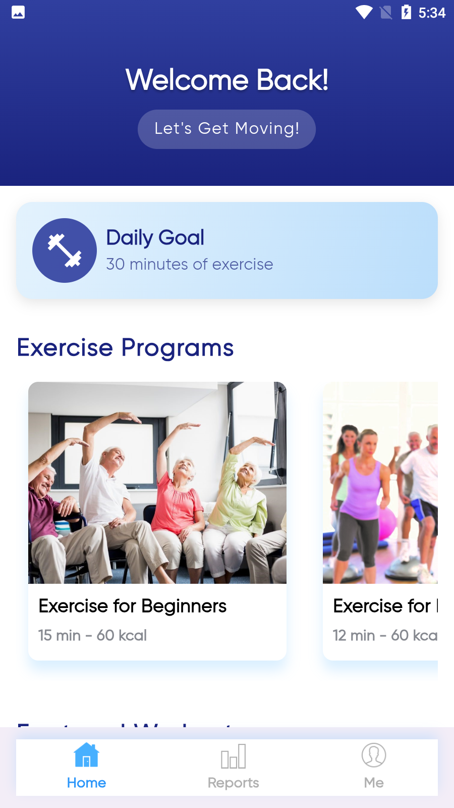
      <p><b>Home Page</b></p>
    </td>
    <td align="center">
      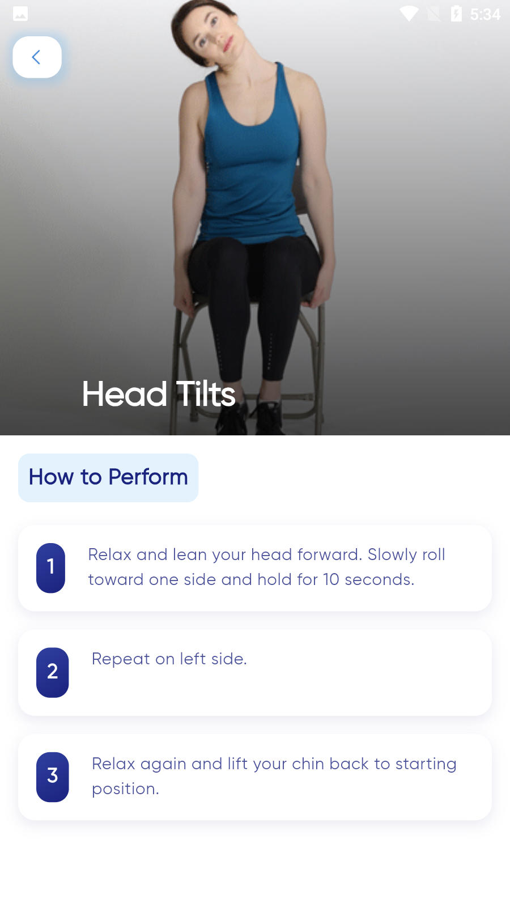
      <p><b>Exercise Details</b></p>
    </td>
    <td align="center">
      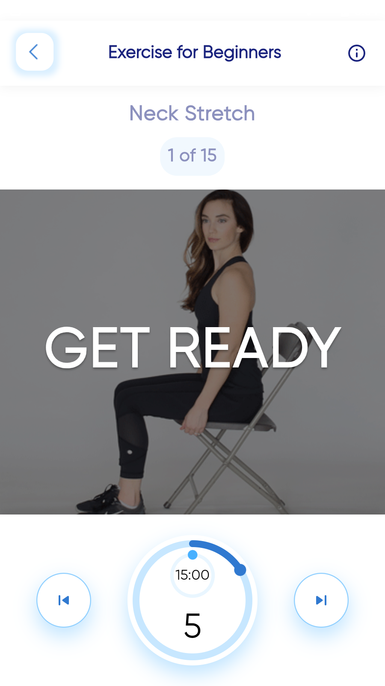
      <p><b>Get Ready Screen</b></p>
    </td>
  </tr>
  <tr>
    <td align="center">
      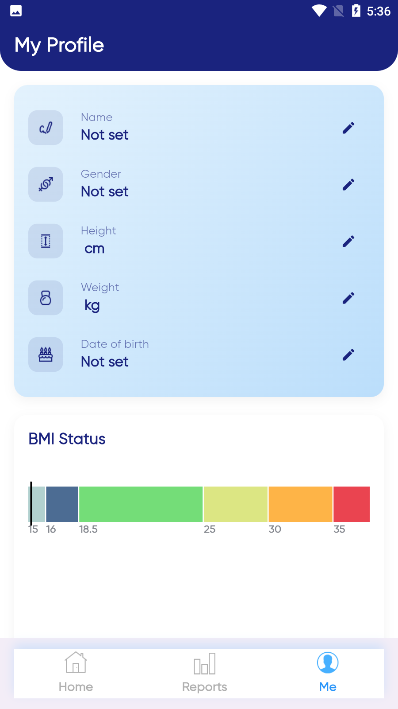
      <p><b>Profile Page</b></p>
    </td>
    <td align="center">
      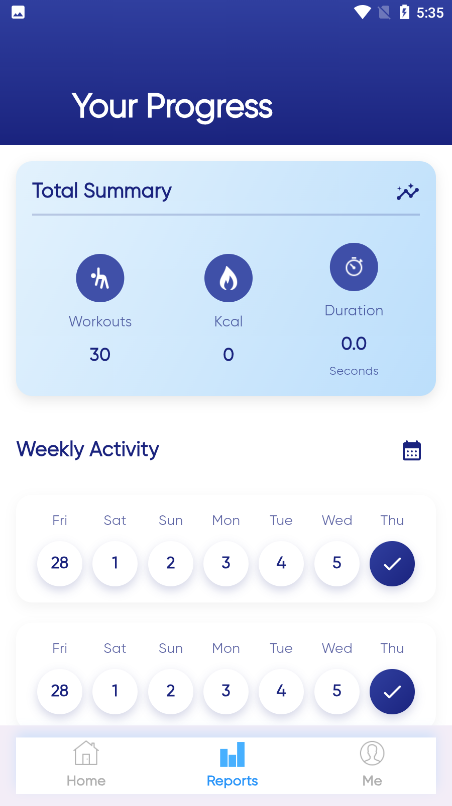
      <p><b>Progress Page</b></p>
    </td>
    <td align="center">
      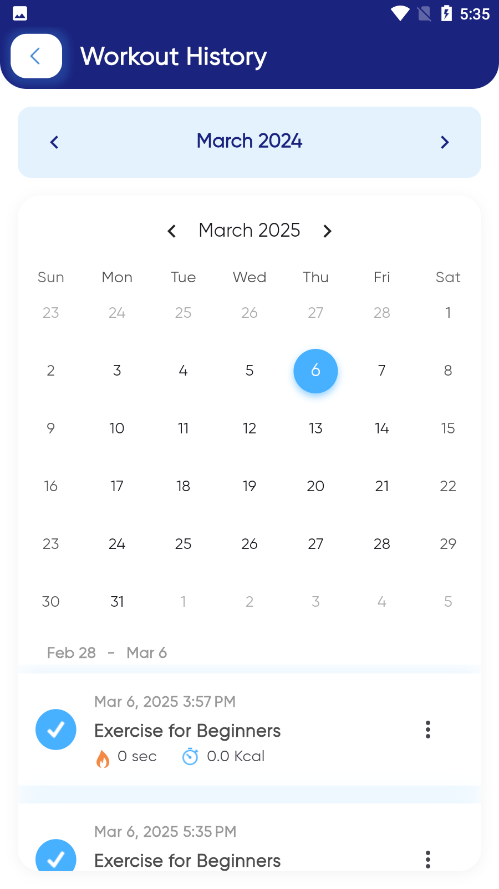
      <p><b>Workout History</b></p>
    </td>
  </tr>
</table>

## 📁 Project Structure

```
elderly_exercise_app/
├── lib/
│   ├── database/
│   │   └── exercise_database.dart
│   ├── models/
│   │   ├── exercise.dart
│   │   └── user.dart
│   ├── screens/
│   │   ├── home/
│   │   ├── profile/
│   │   └── exercise/
│   ├── widgets/
│   │   └── custom_widgets.dart
│   └── main.dart
├── assets/
│   ├── images/
│   └── icons/
├── pubspec.yaml
└── README.md
```

## 📥 Installation

Download the latest APK:
[Download APK](https://github.com/jamalihassan0307/elderly-Exercisec-App-with-sqflite-database/releases/download/1.0.4/app-armeabi-v7a-release.apk)

## 👨‍💻 Developer

Developed by [Jam Ali Hassan](https://github.com/jamalihassan0307)

---

<p align="center">
  Made with ❤️ using Flutter and SQLite
</p>
